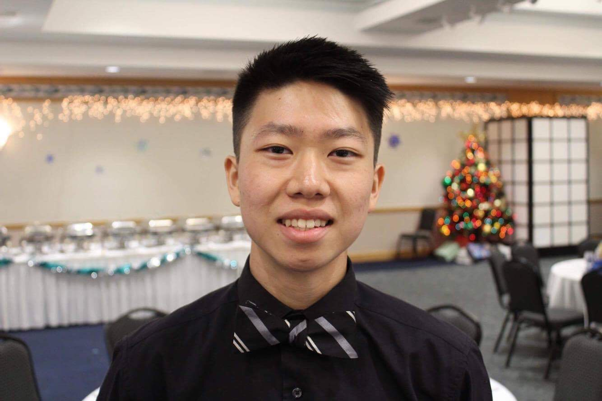

<!-- Hi there! I'm Frank. I am a sophomore at the University of Southern California majoring in Computer Science. For the Summer of 2018, I'm currently researching with a professor at the University of Hawaii at Manoa on the topic of Natural Language Processing and I'm working at Shifted Energy as a student intern dealing with hourly data processing. I hope to attain an internship for Summer 2019, or a co-op for the 2018 - 2019 school year that deals with software or app development. I look forward to all that I'm about to learn in the coming years and hope that I grow both in character and skillset.

For this website, I will be including projects from hackathons or things that I do on the side. Along with that, I hope to include interesting assignments that I have done from relevant coursework and perhaps include adventures that I have around Honolulu or Los Angeles. I hope that this website helps you get to know me a bit better both professionally and a bit more personally. Mahalo! -->

Hi there! I'm Frank. I am a junior at the University of Southern California majoring in Computer Science. I'm passionate about mHealth (mobile health), software development and creating products that improve people's lives.

This past summer, I was a Commercialization Intern at Oceanit Laboratories, an Engineering Consulting company based in Honolulu, HI. There, I applied Design Thinking strategies and worked on iOS development for customized aviation masks using Apple's TrueDepth API. In addition, I managed the company's multi-site on WordPress hosted on Amazon Web Services by making website page speed optimizations, creating content/designing product websites, installing HTTPS and even automating website backups. To learn a little more about the work I've been doing, check out my projects!

I hope that this website helps you get to know me a bit better and I look forward to all that I'm about to learn in the coming years!

