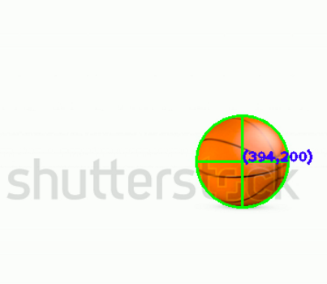
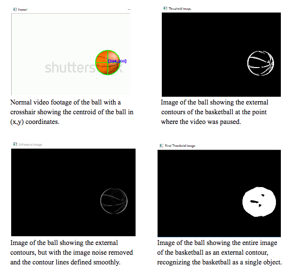

AIRIS is a C++ console application using the [OpenCV](http://opencv.org/) Computer Vision library to track motion in real time through a live-video feed from a camera or a normal video file. This project was a collaborative effort with a classmate of mine and with a STEM Resource Mentor for the Hawaii State Deparment of Education's [Kaimuki-McKinley-Roosevelt Complex Area](http://www.hawaiipublicschools.org/ConnectWithUs/Organization/OfficesAndBranches/Pages/Kaimuki-McKinley-Roosevelt.aspx).

Our mentor taught both of us how to code in C++ and helped us understand the OpenCV library for this project. For the programming side, he helped us construct the basic framework to track motion using the concept of [image differencing](https://en.wikipedia.org/wiki/Image_differencing) and we then used a Windows grid display app for validation during data collection.

To achieve real-time motion detection, AIRIS uses the concept of image differencing in which the current frame is compared to the previous frame. If the current frame is different from the previous frame then there is indeed movement.

This project won Best of Systems Software at the 2016 Honolulu District Science and Engineering Fair and was nominated as a possible project for the Intel Science and Engineering Fair. After the 2016 Honolulu District Science and Engineering Fair, we worked to apply this image differencing algorithm to leukemia detection for the 2016 Hawaii State Science and Engineering Fair -- which resulted in this project receiving the University of Hawaii at Manoa Department of Information and Computer Sciences Award and 3rd Prize in Systems Software.

This project was my very first time coding and it helped me learn a lot about C++ and the topic of Computer Vision. In addition to being mentored, it was a great experience to build my interpersonal skills when working in a team. As both my partner and I had no prior programming knowledge, it was very important that we were patient and worked well with one another. Looking back at the project as a whole, it has made me appreciate team members and mentorship. I hope that in the future I will also be able to share the same depth of knowledge.

 

 
 

This project and my partner and I were also featured on Hawaii News Now on Sunrise for the [March 11](http://www.hawaiinewsnow.com/story/31448254/students-discuss-their-entries-in-the-hawaii-state-science-and-engineer-fair) airing and the [March 22](http://www.hawaiinewsnow.com/story/31539501/interview-hawaii-state-science-engineering-fair) airing.

If you want to learn more about this project, please check out this Github link below!

Source: <a href="https://github.com/fpang0502/AIRIS"><i class="large github icon"></i>AIRIS</a>
