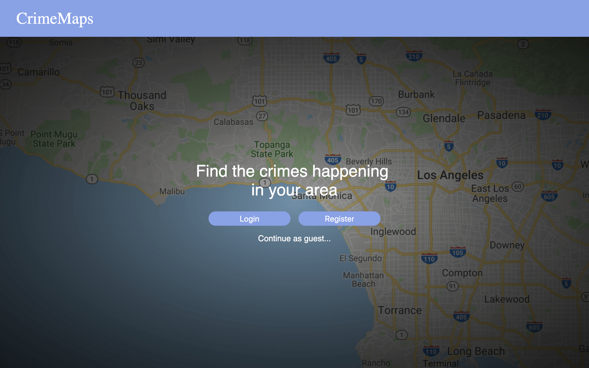

 

 
 

https://github.com/googlemaps/v3-utility-library/tree/master/markerclusterer
If you want to learn more about this project, please check out this Github link below!

Source: <a href="https://github.com/fpang0502/CrimeMaps"><i class="large github icon"></i>CrimeMaps</a>
