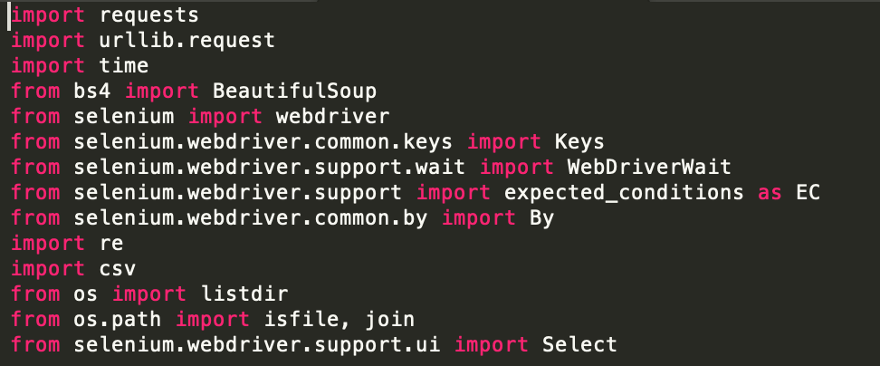
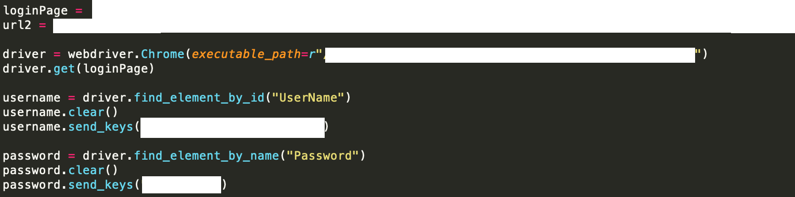
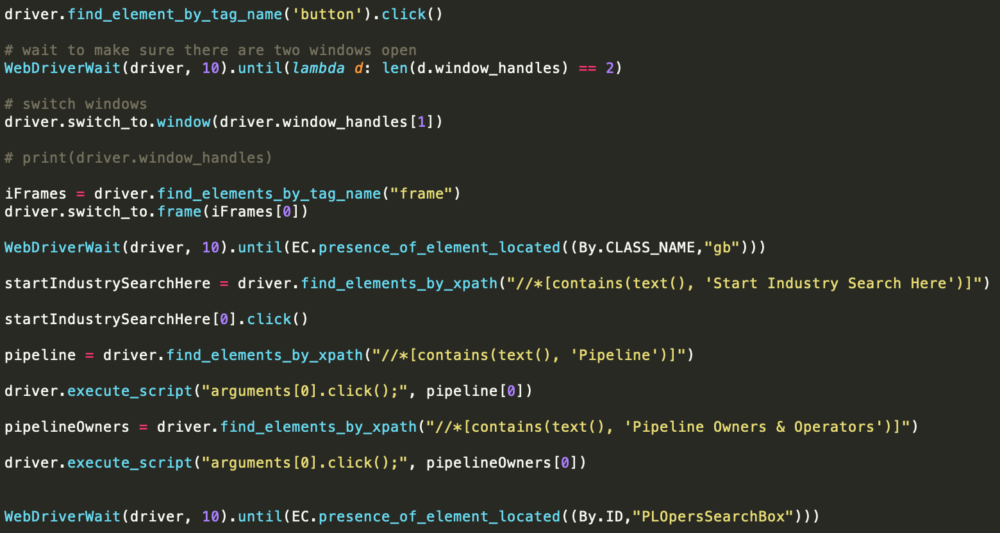
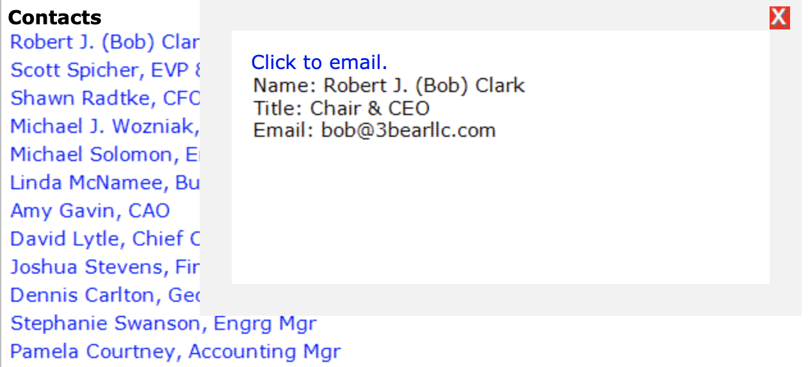
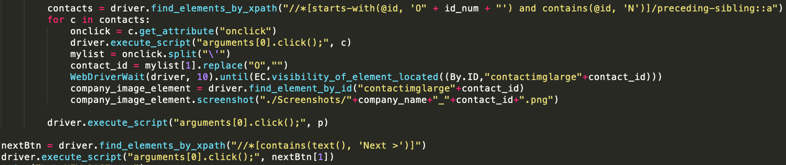
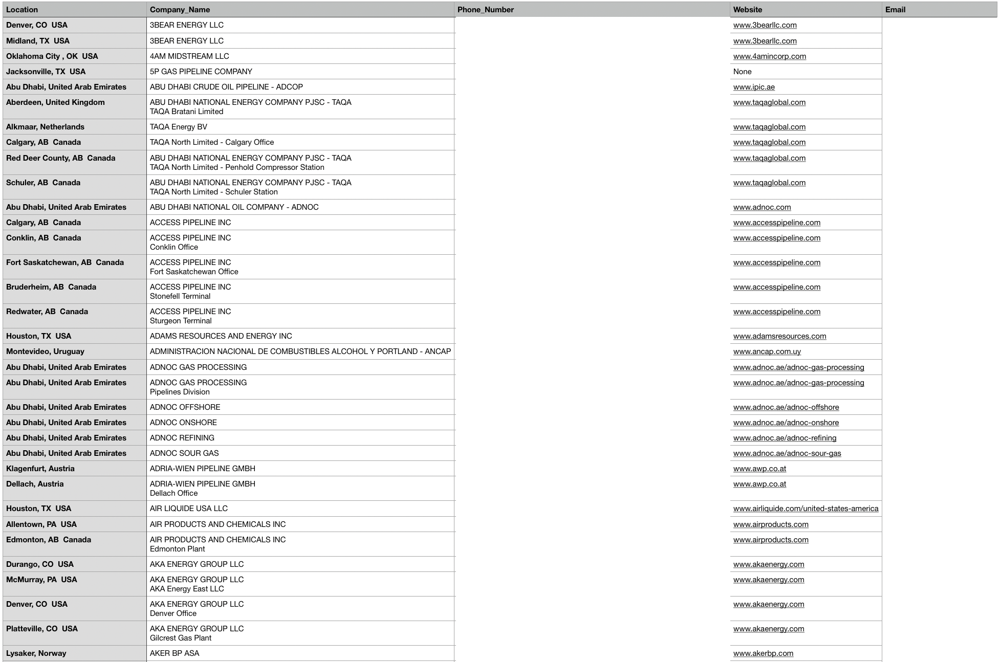

Oceanit is an engineering consulting company based in Honolulu, HI and is highly involved in creating "disruptive innovation." With contracts funded by Small Business Innovation Research programs (SBIR), the company is highly skilled at tackling impossible challenges with creative solutions. 

Part of my internship experience at Oceanit was to take these creative technologies and market them to a broader audience other than the military. One line of products, DragX, is a coating applied to pipelines that reduce the drag of fluids running through the pipe. The person in charge of sales was having a terrible time with the user-interface for the website (Midwest Publishing), and he found it difficult to mass-email individuals/companies. As a result, I took the current subscription credentials and automated the process of collecting pipeline owner contacts into an easily readable CSV file by webscraping via Python, Selenium, and Google Vision API. 

<h2>Selenium</h2>

One of the packages I used for webscraping was Python [Selenium](https://pypi.org/project/selenium/), but it is typically used for web automation testing. I had tried to explore [BeautifulSoup](https://pypi.org/project/beautifulsoup4/), but since I was so unfamiliar with webscraping (this was my first time), I had no idea which to use. In the end, I chose Selenium because you can do it with/without a browser (head/headless) and I didn't really explore BeautifulSoup after; mostly because I noticed Selenium allowed me to visualize the browser and its elements, giving me a clear idea of whether javascript rendering would prevent me from seeing elements to scrape data from. In the future, I would like to explore BeautifulSoup or running Selenium headlessly, as it would be much more efficient. In addition, instead of running multiple terminals, I could spawn multiple threads to process data quicker.

Overall, with Selenium, you are able to select web elements and extract information or even perform actions such as clicking a button, entering text, and submitting a form. As a result, you can login to websites, access any given information on the website, and scrape the information you want by examining patterns in how the website is layed out. 

<h2>Logging In</h2>

Above is how I queried a certain website, and entered the respective login credentials that were necessary. Thereafter, I selected certain elements I needed to interact with, and navigated to the correct pages. An example of that is below. You can use the webdriver to find certain elements on the page with "find_element(s)_ by_....". And as a result, you may have to call "WebDriverWait" due to elements on the page not being accessible yet. For this website, since a lot of the information is rendered and created using JavaScript, it was important that I waited until an element is available before I tried to interact or scrape it, otherwise Selenium would treat it as if it didn't exist.

<h2>Navigating & Processing</h2>

 Besides trying to navigate and figure out how the website rendered its elements, it was a very tricky procedure because the information I wanted to scrape were actually images. An example is the contact information of important company executives. I would need to click on each image for the contact information, and then screenshot it to save into a company folder, then run Google Vision API to extract text from it. From there, I would put it into the CSV file.

<h2>Final Result</h2>

A snippet of the final result of what the CSV file looks like is below. I extracted location, company name, phone/fax numbers, emails, and even websites from the information found on the website.

<h2>More About My Internship</h2>
&#8226;<a href="https://fpang0502.github.io/projects/facefit">FaceFit</a>

&#8226;<a href="https://fpang0502.github.io/projects/wordpress_multisite">WordPress Multisites</a>

&#8226;<a href="https://fpang0502.github.io/projects/school_supply_drive">School Supply Drive</a>
