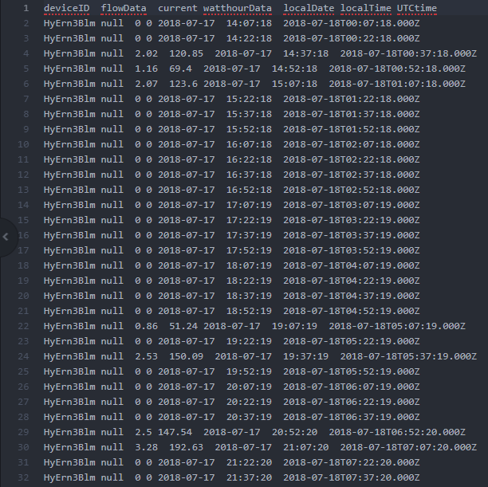
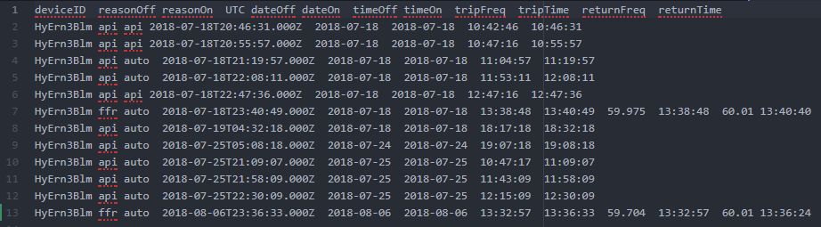

I had the opportunity to intern with Shifted Energy through [Hawaii Technology Development Corporation](https://www.htdc.org/about/) (HTDC), a state agency that is in charge of managing and supervising Hawaii's growing technology industry through providing services for startups. Through HTDC, I learned a lot about Hawaii's growing efforts in technology and more about the entrepreneur mindset.

[Shifted Energy](https://www.shiftedenergy.com/) is a startup in Hawaii that builds IoT controllers and develops software to retrofit electric resistance water heaters into "massively scalable, cost-effective, real-time demand response assets." With the use of machine learning, they are able to analyze the usage patterns of water heaters and provide important grid services such as fast frequency response, capacity load shifting, and emergence demand response. Additionally, they are able to do this without installing the control systems on the water heater.

My role at the company was to automate the JSON data collection received by the IoT devices managed by Shifted Energy through the Automate Green API. By doing so, the information could then be sent to Shifted Energy's webserver for use by grid service providers to make important grid decisions. The existing code written by Olin was in C# and could not be scaled for thousands of devices, so by using Python in the data processing tool that I created, the current script could do the job much faster.

The script I wrote took into account the multiple grid services that Shifted Energy provides: fast frequency response, status updates, and relays. JSON data would vary from each specific service and would appear in a single JSON file. Through parsing them for these specific cases, I was able to generate certain files:  
A master file containing the updates, a relay file that contained relay and ffr events, and multiple files that covers data from each day in a tab-delimited 15-minute increment format.        

This process of exporting files was then automated by reading a textfile for each device, timezone, start date, and the date it was last updated so that it could be scaled for numerous devices. 

If you want to learn more about this project, please check out this Github link below!

Source: <a href="https://github.com/fpang0502/shifted_parser"><i class="large github icon"></i>AllData</a>
