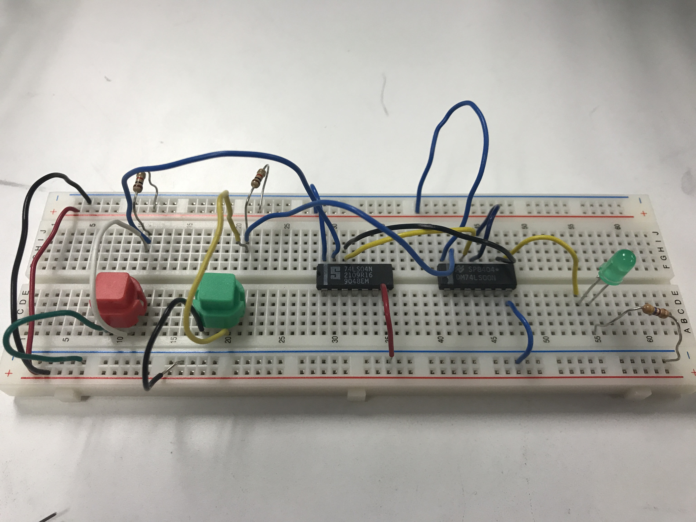
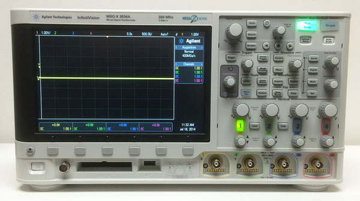

 

 
 

To learn more about this project, you can check out the final project [documentation](../images/rangefinder/rangefinder_pdf.pdf) I had to follow for the final project.

If you want to learn more about this project, please contact me! Due to course restrictions, I am not allowed to share code or specifics.
