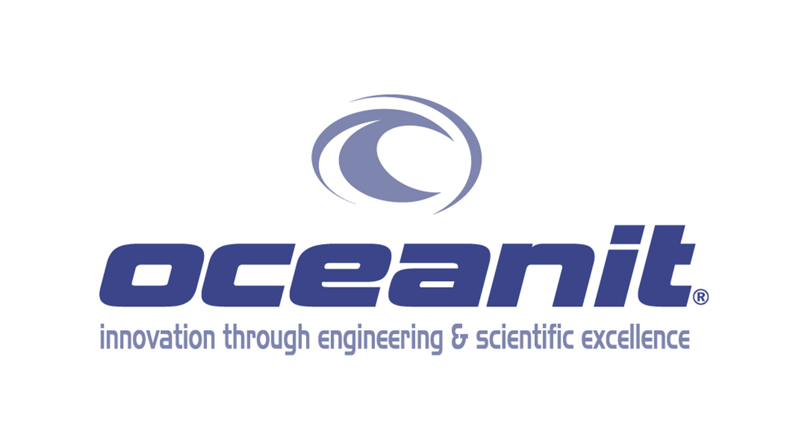

Oceanit is an engineering consulting company based in Honolulu, HI and is highly involved in creating "disruptive innovation." With contracts funded by Small Business Innovation Research programs (SBIR), the company is highly skilled at tackling impossible challenges with creative solutions. 

Part of my internship experience at Oceanit was to take these creative technologies and market them to a broader audience other than the military. To do this, Oceanit spins out multiple websites through WordPress, a content management system based on PHP and MySQL with many plugins and themes to work with. Oceanit has around 15-20 sites and my role as an intern was to fix website bugs, generate website content for new sites, optimize Google Page Speed scores, and install SSL certificates to improve Search Engine Optimization results on Google (basically appear earlier in Google searches). 

<h2>Website Optimizations</h2>
I used [Google Page Speed](https://developers.google.com/speed/pagespeed/insights/) and [Google Lighthouse](https://developers.google.com/web/tools/lighthouse/#devtools) to figure out what optimizations were needed for each of the sites. Ideal options to improve scores were: 
<ul>
	<li>Properly size images</li>
	<li>Defer offscreen images</li>
	<li>Minify CSS/JavaScript</li>
	<li>Remove unused CSS</li>
	<li>Preload key requests</li>
	<li>Serve images in next-gen formats</li>
</ul>

I had never worked on WordPress before, and only knew how to create websites from scratch. With no prior server management or optimization experience, I began furiously Googling and reading documentation on WordPress. So after an hour of reading, manually resizing, uploading optimized images, and fiddling around the sites, I finally realized the beauty of WordPress' plugins that would do the job for me. 

After fiddling with different plugins and comparing their results, the free plugins I ended up using were Autoptimize, Smush, and Lazy Load. Premium versions would have allowed for better results, but just from these, I was able to improve the PageSpeed scores of all the websites from 20-30 to about 70-80 and improve page load speed from 5-10 seconds to about 2 seconds! This was a big improvement! To make more progress, I found that I needed access to the actual server hosted on [Amazon Web Services EC2](https://aws.amazon.com/ec2/?nc2=h_m1). However, Oceanit lost the .pem keyfile needed to SSH into it... 

<h2>AWS EC2 Server Recovery</h2>

These key files are essential for accessing the server, and they're only generated once at the time of creating the server; so recovering it is impossible. Instead, I was able to find documentation and a video on how to recover access to the server using this [tutorial](https://aws.amazon.com/premiumsupport/knowledge-center/recover-access-lost-key-pair/). I basically created a new instance (A) and edited the allowed keyfiles of the old instance (B) to also include the new keyfile generated by making instance A. This was a very risky procedure because all of Oceanit's websites would stop, and there was a possibility that the whole webserver's data could be wiped. So after outlining the steps of the tutorial, and creating Oceanit's very first website backups through [UpdraftPlus](https://wordpress.org/plugins/updraftplus/), I was able to recover access to the instance. After, it turns out the website really was wiped clean. So after some panicking, I uploaded the backup, fixed some login and configuration issues, and the entire WordPress structure was back online! I wouldn't be fired! Haha.

<h2>Installing/Automating SSL Certificates</h2>

The next step in improving SEO was to figure out how to install SSL certificates so all the websites would be covered with HTTPS. I talked to multiple SSL providers and all of them said that I would need to cover both non-www and www domains. So for an example, if I wanted to cover one site called dragxsurfaces.com, I would need to cover the following:

<ul>
	<li>www.dragxsurfaces.com</li>
	<li>dragxsurfaces.com</li>
	<li>www.dragxsurfaces.oceanitlabs.com</li>
	<li>dragxsurfaces.oceanitlabs.com</li>
</ul>

With up to 20 multi-sites we needed to cover, that would amount to 80 domains every year, costing Oceanit under $1000/year. This seemed super unreasonable to me, so I kept looking. I ended up stumbling upon Let's Encrypt, an organization that provides free 90-day SSL certificates for websites. At first, it seemed like this wouldn't work out, since we weren't covered under the list of hosting providers Let's Encrypt served. However, since our AWS EC2 instance was created by Bitnami, we could get SSL for free! I followed this [bncert tutorial](https://docs.bitnami.com/aws/how-to/understand-bncert/), and had SSL installed with renewals automated with a cronjob in no time. You can find out more about the actual process [here](../images/wordpress_multisite/SSL_tutorial.pdf).

Their websites are all mapped from a base domain using [WordPress MU Domain Mapping Plugin](https://wordpress.org/plugins/wordpress-mu-domain-mapping/). So when a user query's a domain name such as [supercoolvest.com](https://dragxsurfaces.com), the plugin redirects the subdomain content of [supercoolvest.oceanitlabs.com](https://dragxsurfaces.oceanitlabs.com) and the website is the same.

<h2>Supercoolvest and iBeach Websites</h2>

In addition to making these optimizations, I also created website content for their multisite on WordPress. Two of the products/services that I was mainly involved with were [Supercoolvest](https://supercoolvest.com), and [iBeach](https://myibeach.com). Most of the websites were created using the WordPress PageBuilder but I also created a custom timelapse feature for iBeach using [FFMPEG]() and a dual rangeslider [iOnSlider](). With it, you can view the thousands of pictures taken from a Raspberry Pi 3 and visualize how the beaches change over time. These timelapses are auto-generated per month using python and cronjobs. Along with generating content, I was involved with getting the domain name, registering it through [NameCheap]() (a domain service provider), routing the DNS, and redirecting them to our multisite. 

<h2>More About My Internship</h2>
&#8226;<a href="https://fpang0502.github.io/projects/facefit">FaceFit</a>

&#8226;<a href="https://fpang0502.github.io/projects/midwest_webscrape">Midwest Webscrape</a>

&#8226;<a href="https://fpang0502.github.io/projects/school_supply_drive">School Supply Drive</a>

